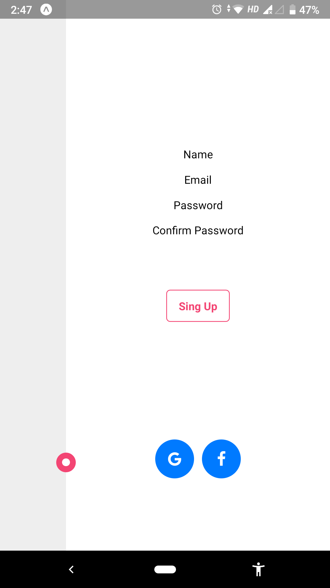
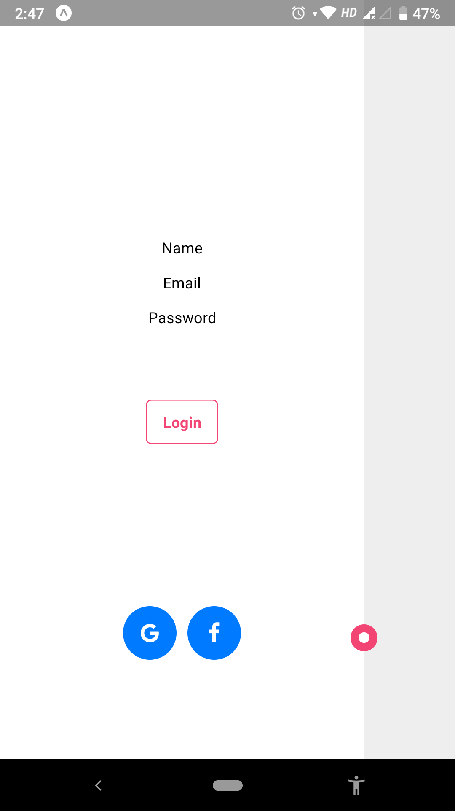

# TwoScreenSlideAnimation

<H2>
Animation are an important part of our application and implementing them in react native isnot an easy task :-P
</H2>

 There exist various animations but a few are becoming quite popular these days, and this mockup shows one of them, which I implemented in reactnative 

